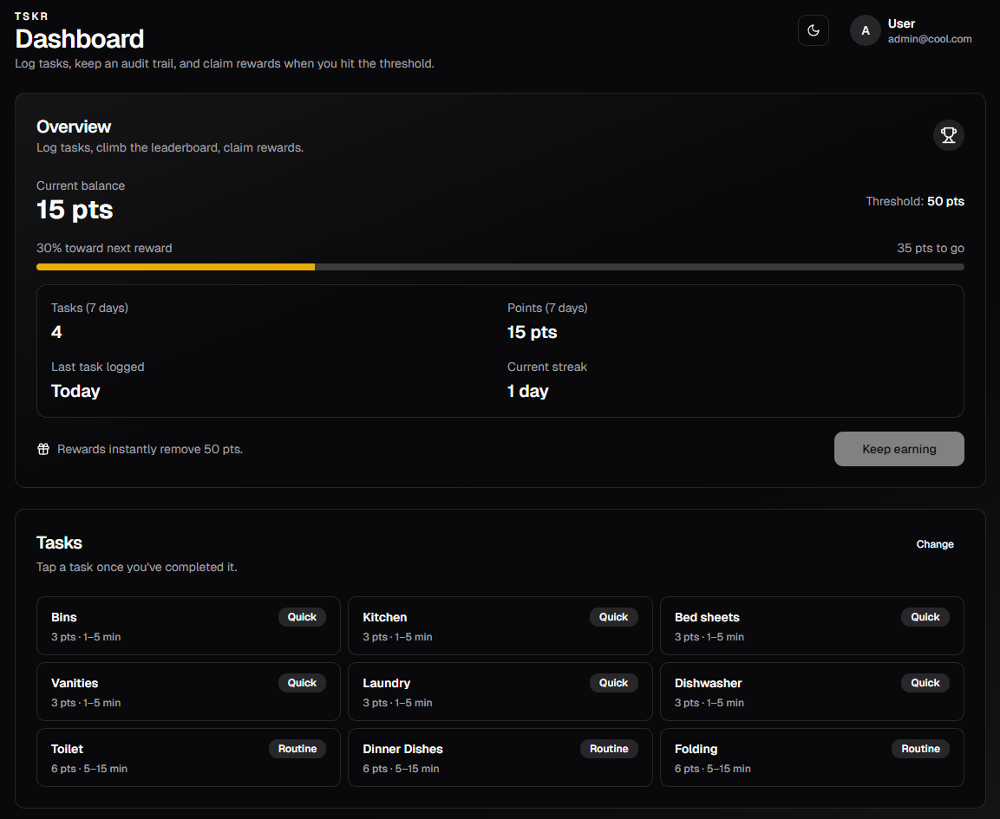

# tskr

tskr makes household tasks fair and visible by assigning chores, logging completions, and turning points into rewards. Recognize hard work with perks like pocket money, reduced rent, or a shared flatmate pool.

Built for families, roommates, and shared houses that want a simple points-based chore loop.



More screenshots: [Assignments](screenshots/assignments.png), [Household](screenshots/household.png)

## Features

- Assign tasks and log completions with an approval flow.
- Track points, streaks, and reward progress on a shared dashboard.
- Keep an audit trail and leaderboard to stay aligned.
- Organize by household with role-based access.

## Tech stack

- Next.js 16 + React 19
- NextAuth (credentials + Google OAuth)
- Prisma + SQLite (default)
- Tailwind CSS + Radix UI

## Auth options

- Email + password credentials.
- Optional Google OAuth via `GOOGLE_CLIENT_ID` and `GOOGLE_CLIENT_SECRET`.

## Getting Started

Prereqs:
- Node 24 (matches `flake.nix`) or use the Nix dev shell
- pnpm 10 (via `corepack enable`)

If you have Nix + direnv installed, entering the repo will automatically load the dev shell:

```bash
direnv allow
```

1) Copy the example env file:

```bash
cp .env.example .env
```

2) Update `.env` as needed. At minimum set `NEXTAUTH_SECRET` and `NEXTAUTH_URL`.
   `DATABASE_URL` defaults to `file:./prisma/dev.db`. Google OAuth reads from
   `process.env.GOOGLE_CLIENT_ID` and `process.env.GOOGLE_CLIENT_SECRET` (leave blank
   to disable the Google button). Set `SUPER_ADMIN_EMAIL` to bootstrap the first
   super admin account if none exists; a temporary password is generated and
   logged on first bootstrap (password reset required on first login). Set
   `SUPER_ADMIN_FORCE_PASSWORD=1` to rotate the password on the next bootstrap.
   Push notifications need the VAPID variables.

3) Install dependencies and prepare Prisma:

```bash
pnpm install
pnpm db:generate
pnpm db:setup
```

4) Start the dev server:

```bash
pnpm dev
```

Open [http://localhost:3000](http://localhost:3000) with your browser to see the result.

## Docker

Pull the image:

```bash
docker pull ghcr.io/<owner>/tskr:latest
```

Run the container (persists the SQLite db and generated secrets under `/data`):

```bash
docker run --rm \
  -p 3000:3000 \
  -v tskr-data:/data \
  -e NEXTAUTH_URL="http://localhost:3000" \
  ghcr.io/<owner>/tskr:latest
```

Build and run locally instead:

```bash
docker build -t tskr .

docker run --rm -p 3000:3000 -v tskr-data:/data --env-file .env tskr
```

Notes:
- `DATABASE_URL` is optional; the entrypoint defaults to `file:/data/dev.db`.
- Migrations run on container start when Prisma migrations are present.
- Set `NEXTAUTH_SECRET` for stable sessions. If unset, the entrypoint generates one and
  stores it in `/data/tskr-secrets.env`.
- Google OAuth reads `GOOGLE_CLIENT_ID` and
  `GOOGLE_CLIENT_SECRET` (leave them blank to disable the Google button).
- Set `VAPID_PUBLIC_KEY`, `VAPID_PRIVATE_KEY`, and `VAPID_SUBJECT` to enable push
  notifications; otherwise the entrypoint will generate keys on first run.
