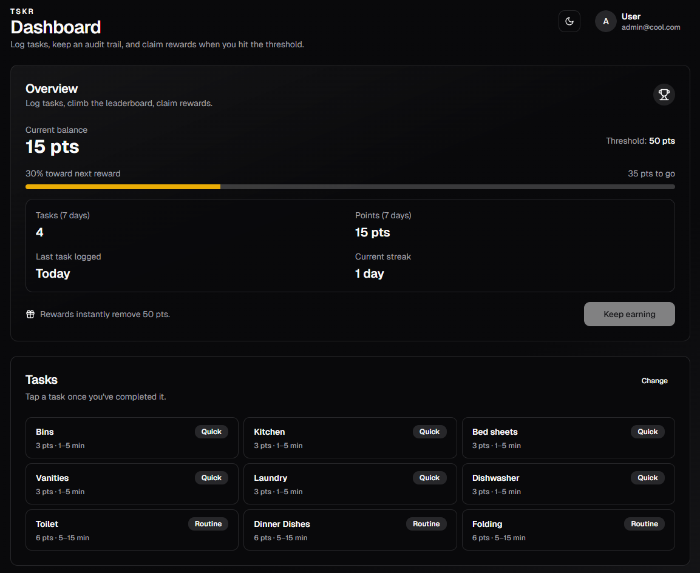

# tskr

tskr makes household tasks fair and visible by assigning chores, logging completions, and turning points into rewards. Recognize hard work with perks like pocket money, reduced rent, or a shared flatmate pool.

Built for families, roommates, and shared houses that want a simple points-based chore loop.



More screenshots: [Assignments](screenshots/assignments.png), [Household](screenshots/household.png)

## Features

- Assign tasks and log completions with an approval flow.
- Track points, streaks, and reward progress on a shared dashboard.
- Keep an audit trail and leaderboard to stay aligned.
- Organize by household with role-based access.

## Tech stack

- Next.js 16 + React 19
- NextAuth (credentials + Google OAuth)
- Prisma + SQLite (default)
- Tailwind CSS + Radix UI

## Internationalization

Translations live in `src/locales/<lang>/translation.json`. Locale folders must be lowercase (e.g., `en`, `pt-br`).

Add a new language:
1. Create `src/locales/<lang>/translation.json`.
2. Run `pnpm i18n:sync` to regenerate `src/locales/supported.json`, enforce static translation keys, and update locale keys from the codebase.

`i18next-scanner` is configured to prune unused keys (`removeUnusedKeys: true`).
CI runs `pnpm i18n:check` to ensure locale files are up to date and dynamic translation keys are not used.

Translation workflow:
- Run `pnpm prep` before opening a PR. This is the primary local quality gate.
- `prep` includes i18n sync, lint fixes, TypeScript compile, a production build, and tests.
- `check` includes i18n sync, lint, TypeScript compile, a production build, and tests.
- Run `pnpm i18n:sync` when you only want to refresh locale files while working.
- CI runs `pnpm i18n:check`, which fails if locale files would change.

## Auth options

- Email + password credentials.
- Optional Google OAuth via `GOOGLE_CLIENT_ID` and `GOOGLE_CLIENT_SECRET`.

## Getting Started

Prereqs:
- Node 24 (matches `flake.nix`) or use the Nix dev shell
- pnpm 10 (via `corepack enable`)

If you have Nix + direnv installed, entering the repo will automatically load the dev shell:

```bash
direnv allow
```

1) Copy the example env file:

```bash
cp .env.example .env
```

2) Update `.env` as needed. At minimum set `NEXTAUTH_SECRET` and `NEXTAUTH_URL`.
   `DATABASE_URL` defaults to `file:./prisma/dev.db`. Google OAuth reads from
   `process.env.GOOGLE_CLIENT_ID` and `process.env.GOOGLE_CLIENT_SECRET` (leave blank
   to disable the Google button). Set `SUPER_ADMIN_EMAIL` to bootstrap the first
   super admin account if none exists; a temporary password is generated and
   logged on first bootstrap (password reset required on first login). Set
   `SUPER_ADMIN_FORCE_PASSWORD=1` to rotate the password on the next bootstrap.
   Push notifications need the VAPID variables.

3) Install dependencies and prepare Prisma:

```bash
pnpm install
pnpm db:generate
pnpm db:setup
```

4) Start the dev server:

```bash
pnpm dev
```

Open [http://localhost:3000](http://localhost:3000) with your browser to see the result.

## Releases

Releases use [Release Please](https://github.com/googleapis/release-please-action).
After a push to `main` passes i18n, lint, TypeScript compilation, tests, the
production build, and a container startup check, the workflow creates or updates a release PR with the version
bump and changelog. Merge that PR when the changes are ready to ship. The merged
commit must pass the same checks before the workflow creates the `x.y.z` tag and
GitHub Release, then publishes the release image to GHCR for amd64 and arm64.
`latest` advances after the image is published. The release notes include the
immutable image digest for deployments.

Use Conventional Commit titles for squash merges:

| Prefix | Version effect |
| --- | --- |
| `fix:` or `perf:` | Patch |
| `feat:` | Minor |
| `!` or a `BREAKING CHANGE:` footer | Major |
| `docs:`, `test:`, `ci:`, `build:`, `style:`, `refactor:`, `deps:`, ordinary `chore:` | No release by themselves |

User-visible dependency or container fixes should use `fix(deps):` or
`fix(container):` so they ship. Tags keep the existing format without a `v`
prefix. Release Please now manages `package.json` and
`.release-please-manifest.json` together, starting from the existing `1.2.0` tag.
Do not manually bump versions, cut tags, or publish images.

Repository setup:

1. Install the release bot GitHub App on this repository with **Contents**,
   **Issues**, and **Pull requests** read/write permissions. Add repository
   Actions environment secrets `RELEASE_BOT_APP_ID` and `RELEASE_BOT_PRIVATE_KEY`
   in the `release` environment, as in
   `obsidian-sync-mcp`. The App token lets the release PR trigger CI automatically.
2. Restrict the `release` environment's deployment branches to `main`.
3. Require the `build-and-lint` CI job in branch protection for `main`.

If publication fails after the GitHub Release is created, rerun the failed CI
workflow for that merged release commit. It verifies the tag points to the exact
tested commit, reuses an existing multi-architecture image if one was already
published, and repairs the release notes. Retrying an older release does not
move `latest` back. Publishing is part of the same workflow, so tags created
with `GITHUB_TOKEN` do not need to trigger another workflow.

## Docker

Pull the image:

```bash
docker pull ghcr.io/jonocairns/tskr:latest
```

Run the container (persists the SQLite db and generated secrets under `/data`):

```bash
docker run --rm \
  -p 3000:3000 \
  -v tskr-data:/data \
  -e NEXTAUTH_URL="http://localhost:3000" \
  ghcr.io/jonocairns/tskr:latest
```

For a repeatable deployment, use the `ghcr.io/jonocairns/tskr:x.y.z@sha256:…`
reference from the GitHub Release notes. Publishing an image does not restart
an existing container; pull the chosen release and recreate your container with
the same `/data` volume.

Build and run locally instead:

```bash
docker build -t tskr .

docker run --rm -p 3000:3000 -v tskr-data:/data --env-file .env tskr
```

Notes:
- `DATABASE_URL` is optional; the entrypoint defaults to `file:/data/dev.db`.
- Migrations run on container start when Prisma migrations are present.
- Set `NEXTAUTH_SECRET` for stable sessions. If unset, the entrypoint generates one and
  stores it in `/data/tskr-secrets.env`.
- Google OAuth reads `GOOGLE_CLIENT_ID` and
  `GOOGLE_CLIENT_SECRET` (leave them blank to disable the Google button).
- Set `VAPID_PUBLIC_KEY`, `VAPID_PRIVATE_KEY`, and `VAPID_SUBJECT` to enable push
  notifications; otherwise the entrypoint will generate keys on first run.
